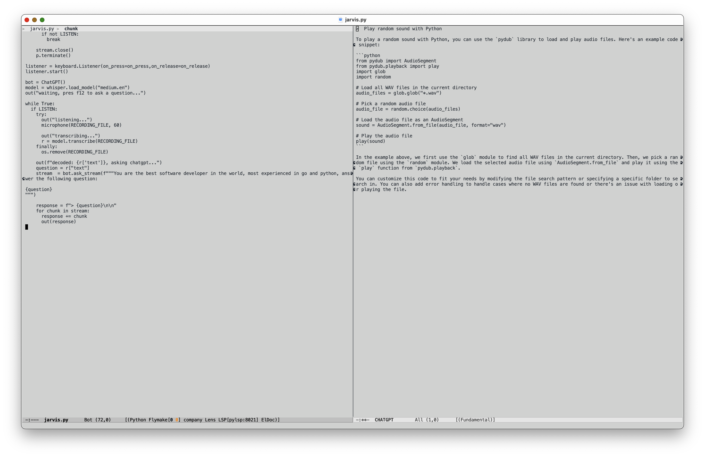

# PROOF OF CONCEPT

> I always dreamed of not leaving emacs, with eww and chatgpt I am closer than ever.

This is a proof of concept program that allows you to use voice to interact with chatgpt and see the result in emacs.

ress F12 and it will record you (until you release F12) and transcribe the text using openai's whisper, ask chatgpt and print the output in the buffer.

__It stores the recording (up to 60 seconds) in /tmp/jarvis-chatgpt.wav__

Video: [example.mov](example.mov)

# install

* install https://github.com/openai/whisper
* pip install pyaudio pynput
* install https://github.com/mmabrouk/chatgpt-wrapper

Edit jarvis.py if you want to use another key

# running and using

* `python jarvis.py` (first time it has to download the medium.en model which is 1.4gb) and then it takes a minute to load it
* start emacs, and open the CHATGPT buffer
* press F12 to use

